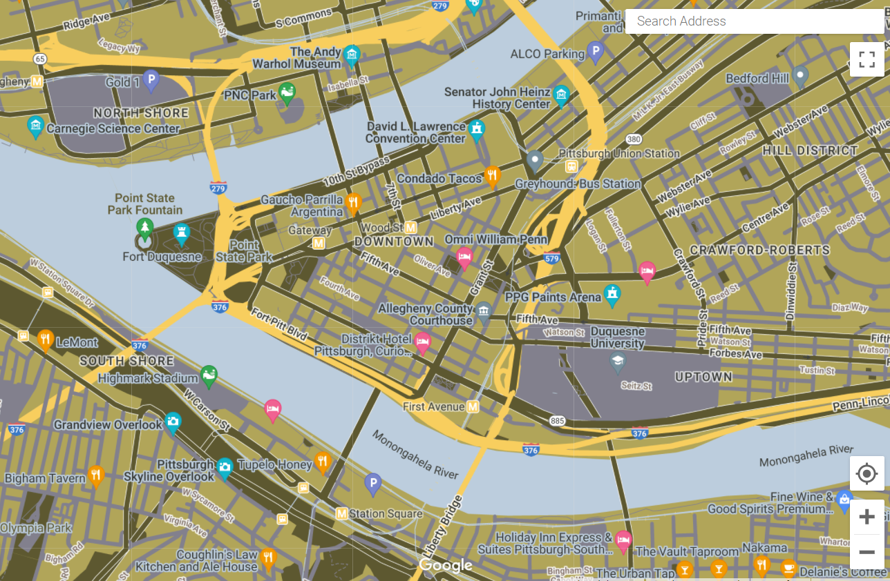

# Custom Google Map for BikePgh

In this assignment, I created a custom Google-Map for a local non-profit BikePgh.  I took a screenshot of a representative image on the BikePgh website and uploaded it to Adobe Color to pull out important colors. I started the customization by selecting the “Retro” base theme, since it was similar to the feel of the BikePgh website. I then changed the colors of the land/water, infrastructure, and labels to align with the colors and overall style exhibited on the BikePgh website. See the website screenshot, colors, and the corresponding hex codes below.  I also added a 6th color found in the screenshot, Heavy Metal (#373934) that is not pictured below, for labels and increased contrast on the map. 

For this initial map-creation round, my goal was to make a map that showcases the color palette and “feel” of the BikePgh map, while maintaining good map-making and design principles. In future iterations of the map, I would hope to integrate BikePgh’s specific functionality goals into the design. Some of the design decisions I made in this first iteration include changing:
- the labels to Heavy Metal (#373934) for maximal readability
- the urban land to the light green (#B1A559) as fairly neutral base layer
- the natural landscape/parks to the dark green (#5D5830) to mimic natural green space
- the points of interest to the gray (#82808D) to contrast the green background
- the highways to the yellow (#F8CE5E) to majorly contrast the green background
- the arterial roads to the dark green (#5D5830) 
- the local roads to the gray (#82808D) 
- the transit lines to the light blue (#BCCDDD)
- and the water to the light blue (#BCCDDD) as well to represent water 

Below are 3 screenshots of the custom map at varying scales. The JSON code for the map can be found [here](/CustomGoogleMapCode.json). 

Perhaps something I would discuss with the BikePgh team for the next iteration of the map is whether they would prefer the transit and bike infrastructure to be yellow, instead of the highways. Since yellow acts as an “accent” color in this scheme, the viewer's eyes are quickly drawn to the yellow elements. Since BikePgh advocates for better bike (and transit) infrastructure, perhaps, they would prefer viewer’s eyes to be drawn to the bike/transit infrastructure instead of the highways. I choose yellow for highways in this version purely for aesthetic reasons, but I would love to integrate the mission of the organization with the design in future versions of the map.

Overall, this was a great assignment to experiment with easy-to-use mapping and design tools! 
