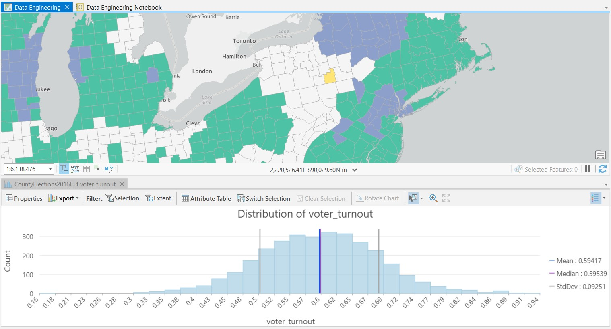

# Data Engineering and Visualization Tutorial

In this learning module, I completed ESRI's "Perform Data Engineering Tasks" and "Explore Data Using Data Visualization Techniques" Spatial Data Science MOOC tutorials.

In the first exercise, I learned how to import python modules into ArcGIS using Notebooks. I also learned how to geoenrich the data to add demographic variables to attributes in the feature class. I thought the geoenrichment tool was super powerful. I had done something similar in the ArcGIS Insights, and I am glad to learn that it can be almost as straightforward in ArcGIS Pro. 

In the second exercise, I manipulated the 2016 election data set, which was enriched in the previous exercise, to explore ArcGIS Pro’s graphing and data visualization tools. I learned how to generate descriptive statistics, histograms, bar charts, choropleth maps, box plots, scatterplot matrix plots, and the local bivariate relationship tool. As we discussed briefly in class, I was unaware that ArcGIS Pro had these fairly intuitive graphing and data visualization capabilities that we have thus far associated with ArcGIS Insights or Tableau! I think what I was most impressed by was how ArcGIS Pro automatically links the multiple charts with the map and chart filters/selections. For example, after creating a box plot we could click on a few of the outlier points to highlight those counties on the map. Or after creating a histogram, we could filter by extent or filter by selection. I was also very impressed by the scatterplot matrix option and the local bivariate relationship tool. I had only conducted those types of analyses in R before, and I thought it was cool that you can do that in ArcGIS and have the spatial linkage. 

[Back to the AdvancedGIS homepage](/README.md)
