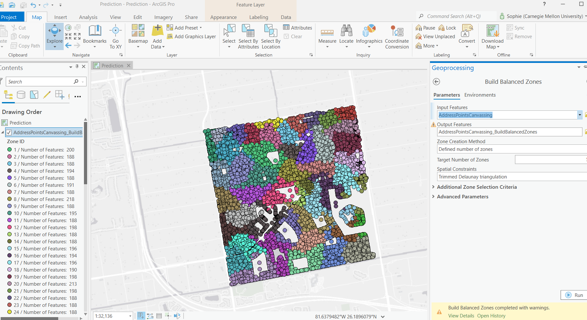

# Prediction Model and Build Balanced Zones Tutorials

In this learning module, I completed ESRI’s “Create a Prediction Model” Spatial Data Science MOOC tutorial.

In this assignment, I learned how to build and refine a predictive model using the Forest-Based Classification and Regression Tool (Spatial Statistics). I began by building a simple model with the 4 explanatory variables (education, median age, per capita income, and owning a selfie stick). I learned how to read the outputs of the tool including  validation diagnostics, variable importance, and prediction interval charts. The validation r-squared value is more accurate than the testing training values, because the training dataset is vulnerable to overfitting. 

The tutorial then includes several methods to improve the accuracy of the prediction model. First, I learned how to add and subtract variables from the model based on variable importance levels. These variables included distance, categorical (county voting requirements), and demographic data. Second, I learned how to increase the number of trees and model runs to improve accuracy. The tutorial suggests examining the “Model Out of Bag Errors” to see whether increasing the number of trees improves accuracy. In this example, more trees did not appear to increase accuracy. However, some of the steps in the tutorial took several minutes for my computer to run. So, for the last few steps I used less trees than suggested in the tutorial, and my accuracy was indeed slightly lower than the tutorial. As part of the model-building process I suppose you must decide between the level of accuracy and time/computing power. Third, I learned how to use data for a smaller region of the country to improve accuracy of predictions for that region. At the end of the tutorial, I applied the refined and localized prediction model to predict voter turnout in Iowa. 

I then completed the tutorial extension, where I used the Build Balanced Zones (Spatial Statistics Tools) to define 50 zones of the Canvassing Address Points in Naples, FL. See the resulting output below. 

[Back to the AdvancedGIS homepage](/README.md)
