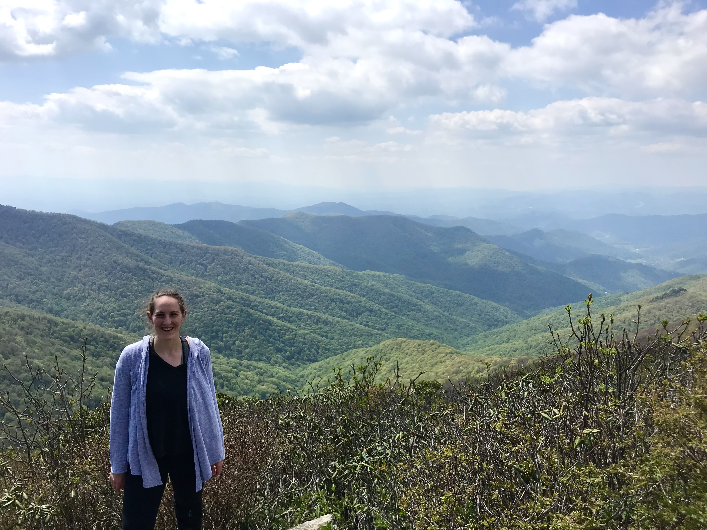

# AdvancedGIS
Advanced GIS portfolio

# About me
I’m Sophie Abo, a second year in the MS Public Policy and Management program at Carnegie Mellon University (CMU). I grew up in Pittsburgh and completed my undergraduate degree in Environmental Health and Biology at Washington University in St. Louis. I returned to Pittsburgh for the Coro Fellowship in Public Affairs and stuck around to attend CMU! This past summer I interned at the Brookings Institution in the Metropolitan Policy Program as an Infrastructure Research Intern. My interests include infrastructure policy and planning, economic development, and sustainability! After graduation, I hope to work in the fields of urban planning and transportation policy. I'm seeking opportunities that will allow me to use my research, data analysis, and technical project management skills to address our built environment's most pressing challenges and opportunities.

Outside of school/work, I love biking, exploring Pittsburgh and other cities, and cooking and baking! This photo is from a trip to Asheville, NC last summer.

# What I hope to learn 
During this Advanced GIS class, I hope to further my GIS skills, learn new mapping techniques, and learn about other open source mapping platforms. I am very excited to maintain and build on my mapping and spatial analysis skills! 

# Portfolio
[1. Custom Google Map for BikePgh](/CustomGoogleMap.md)

[2. Using ArcGIS Insights to Explore DEA Pain Pill Database](/PainPills.md) 

[3.Data Engineering and Visualization Tutorial]/(DataEngineering_Visualization.md)

[4. Custom Styles in Mapbox](/Mapbox.md) 

[5. Exploring Electric Vehicle Charging Stations Database](/FinalProject.md)
